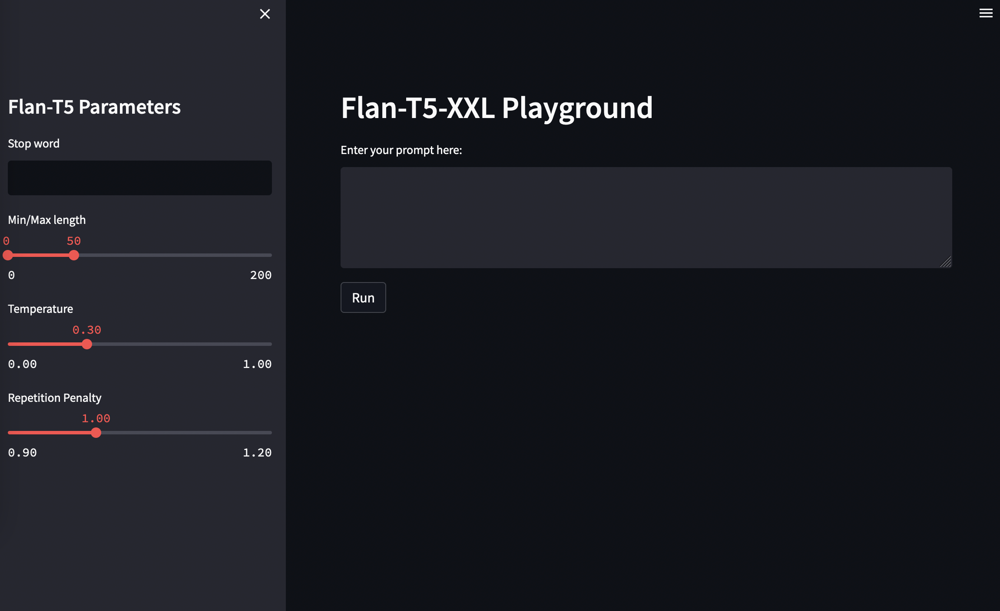

# llm-playground-sm-studio
A repo to demonstrate how to set up an LLM playground in SageMaker Studio.

## Set up
Inspired by the documentation on how to use [TensorBoard in SM Studio](https://docs.aws.amazon.com/sagemaker/latest/dg/studio-tensorboard.html), we can use the same mechanism to spin up a [Streamlit](https://streamlit.io) app in SM Studio.

To do so, just execute the command `streamlit run app.py --server.port 6006` in the terminal. After that you will be able to access the playground on `https://<YOUR_URL>.studio.region.sagemaker.aws/jupyter/default/proxy/6006/`.